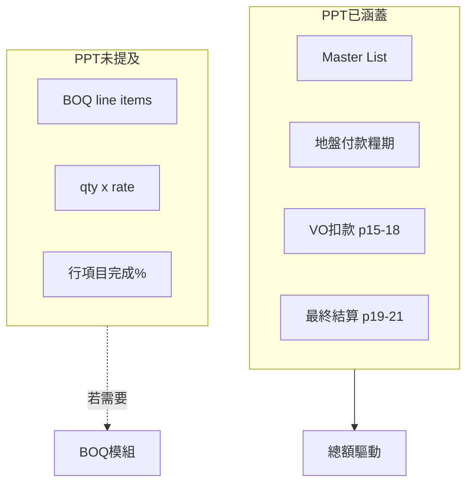

# BOQ 模組決策 — QS 會議簡報

> **用途**：與 QS 對齊 30 分鐘；決定 BOQ 是否納入 OSsysCU 第一期範圍。  
> **會議紀錄範本**：[`BOQ Decision - Meeting Notes.md`](BOQ%20Decision%20-%20Meeting%20Notes.md)  
> **技術背景**：[`BOQ Workflow.md`](BOQ%20Workflow.md)

---

## 1. 為何要開這個會？

PPT 第一期（p5、p15–18、p19–21）與 [`PENDING.md`](../PENDING.md) **均未列 BOQ 模組**，但開發過程中出現兩類「像 BOQ」的需求：

| 線索 | 現況 |
|------|------|
| OCR 報價單可解析「序號／部位／工程量」 | 只寫入判項描述文字，**不入庫** |
| Cover Page 可上傳 **SOT & SOR** | 存附件，**無結構化行項目** |
| 中期糧款 **C 行 Material On Site** | 模板有 `vo_material`，計算書 **恒 0** |
| 主合約 FAC **(B) Remeasurement / (E) Provisional Qty** | **手填總額**，無 qty×rate 引擎 |

需 QS 確認：這些是否足夠，還是需要完整 BOQ 模組。

---

## 2. 現階段建議（會前立場）

**暫不開發完整 BOQ 模組**，除非 QS 確認糧款必須由 line-item 計量驅動。

理由：

1. PPT / 匯報路線圖 Phase 1–6 無 BOQ 計劃  
2. 現有 code 以 **header-level 總額** 覆蓋已畫流程（判項價、VO、Excel 糧期、FAC A–H）  
3. BOQ 為大型橫切模組；在 A–E 雙公式（Q1.1）、VO 計入口徑（Q1.2）未解前不宜加第二套引擎  

---

## 3. 現況對照表（可投影給 QS）

| 業務需求 | 現有能力 | 缺口 |
|----------|----------|------|
| 判項合約價 | `subcontractors.contract_amount` | — |
| 變更／扣款 | `sc_vo_records` + 中期糧款套用 | — |
| 地盤糧期 IP | Excel 匯入 `interim_payments` | 非 BOQ 完成 % 驅動 |
| 分判中期糧款 A 行 | 手填或反推淨付款 | 非 BOQ × 完成 % |
| 分判中期糧款 B 行 | VO 登記加總 | — |
| 分判中期糧款 C 行 MOS | 模板有、**計算書恒 0** | 需接線或確認不用 |
| 報價明細 OCR | `main.js` 解析 → 描述文字 | 不入庫、不可逐行糧款 |
| SOR／BOQ 存檔 | Cover `attachment3_sot_sor` | 無結構化查詢 |
| 主合約 FAC remeasurement | `fac_remeasurement_b` 手填 | 無 qty×rate |
| 分判 FAC 物料列 | Phase C 待做（手填總額列） | 未實作 |

**Code 證據摘要**（詳見 [`BOQ Workflow.md`](BOQ%20Workflow.md)）：

- 無 BOQ 資料表、無 BOQ API  
- `interim_cert_report.py` L141：`c_cur = c_prev = c_prov = 0.0`  
- `sc_vo_templates.py`：`vo_material` → `C. Material On Site`（未驅動 C 行）

---

## 4. 問題清單（A–C）

### A. 工作流程 — 決定要不要 BOQ

| # | 問題 | 選項提示 |
|---|------|----------|
| A1 | 分判中期糧款 **A 行（合約工程量）** 數字從哪來？ | 判項總額 × 完成 %／Excel 算好手填／其他 |
| A2 | **B 行（後加/改）** 用 VO 登記加總是否足夠？ | 是／否，需 BOQ 逐項匯總 |
| A3 | **C 行 Material On Site** 實務會填嗎？如何計？ | 不用／手填總額／物料清單 × 單價 × 在場比例 |
| A4 | 主合約 FAC **(B) Remeasurement、(E) Provisional Qty** 怎麼做？ | Excel BOQ 算好貼總數／系統存明細 |

### B. 資料載體 — 決定輕量 vs 完整 BOQ

| # | 問題 | 選項提示 |
|---|------|----------|
| B1 | **SOT & SOR** 是否即公司 BOQ？系統要解析入庫嗎？ | 只存附件／要結構化 SOR 行 |
| B2 | OCR 報價「序號/部位/工程量」要持久化可編輯嗎？ | 一次填描述即可／要存判項明細子表 |
| B3 | 分判 FAC「物料/人工加減列」是幾個手填總額還是 BOQ 明細？ | 手填總額列／展開 BOQ |

### C. 優先級 — 避免 scope creep

| # | 問題 | 選項提示 |
|---|------|----------|
| C1 | 相對 Retention 連動、主合約 FAC PDF、分判商主檔、登入 — **BOQ 排第幾？** | 1–5 或「不做」 |
| C2 | 若不做 BOQ，「判項總額 + VO + Excel 糧期 + FAC 手填」可否作第一期上線？ | 可接受／不可，必須 BOQ |

---

## 5. 決策矩陣（會後勾選一項）

| QS 傾向 | 建議動作 | 工作量 | 後續文件 |
|---------|----------|--------|----------|
| 總額 + Excel 算好；SOT/SOR 只存附件 | **Out of scope** | 文件 only | 更新 Q5.2、PENDING |
| 要 MOS / remeasurement 總額，無 line-item | **輕量加強** | 小～中 | [`BOQ Decision - Lightweight Scope.md`](BOQ%20Decision%20-%20Lightweight%20Scope.md) |
| 持久化 OCR 明細，不驅動糧款 | **報價明細子表** | 中 | Lightweight Scope §4 |
| qty×rate、完成 % 驅動 IP/Interim Cert | **完整 BOQ 模組** | 大 | [`BOQ Module Design (Draft).md`](BOQ%20Module%20Design%20(Draft).md) |

---

## 6. 建議會議流程（30 分鐘）

| 時間 | 內容 |
|------|------|
| 0–5 min | 說明：PPT 未列 BOQ；系統現以總額層運作 |
| 5–15 min | 逐題 A1–A4（工作流程） |
| 15–22 min | B1–B3（資料載體） |
| 22–28 min | C1–C2（優先級）+ 勾選決策矩陣 |
| 28–30 min | 確認會後紀錄人填 [`Meeting Notes`](BOQ%20Decision%20-%20Meeting%20Notes.md) |

---

## 7. 附錄：PPT 第一期已涵蓋 vs 未涵蓋

---

*建立：2026-08-14 · 對應 BOQ 模組決策計劃*
