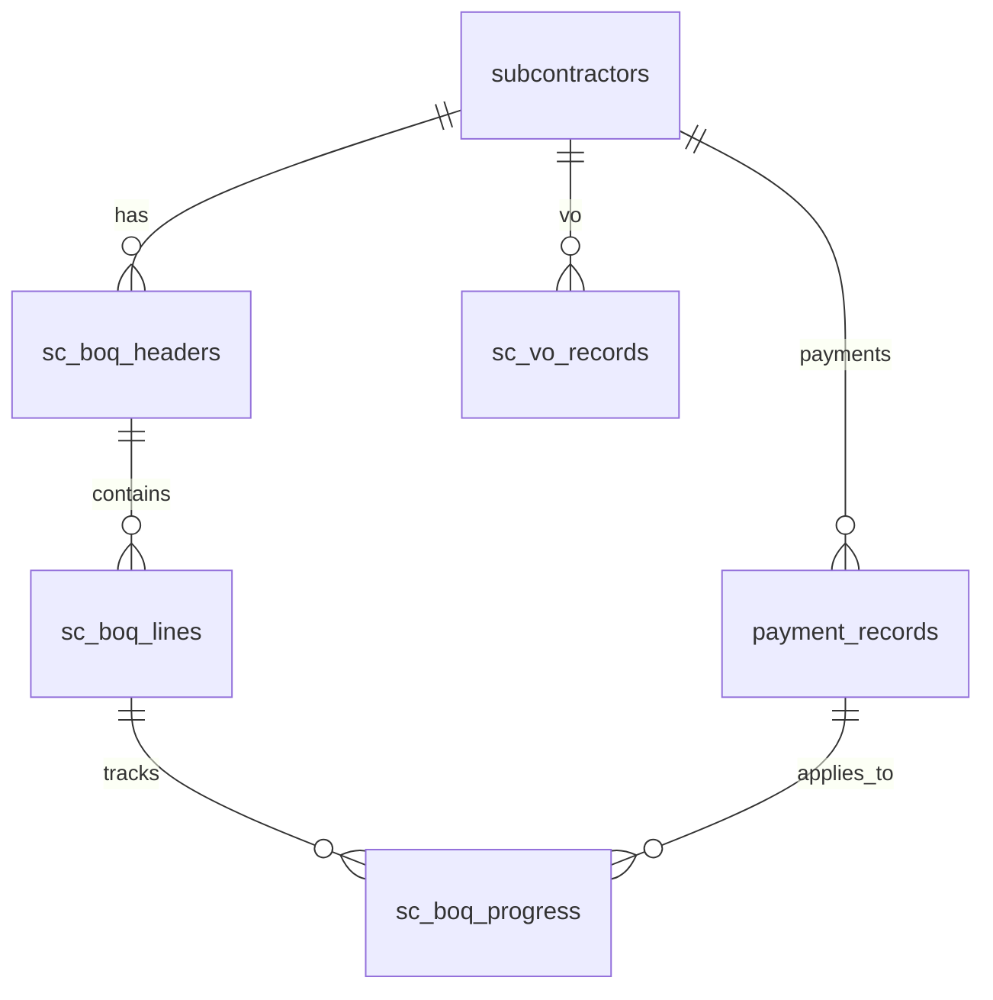

# BOQ 模組設計（草案）

> **狀態**：Draft — **僅在 QS 會議決策為「完整 BOQ 模組」時啟動**  
> **觸發條件**：qty×rate、行項目完成 % 需驅動 IP / Interim Cert  
> **會議紀錄**：[`BOQ Decision - Meeting Notes.md`](BOQ%20Decision%20-%20Meeting%20Notes.md)  
> **現況**：[`BOQ Workflow.md`](BOQ%20Workflow.md) — 目前無 BOQ 表/API

---

## 1. 產品邊界

### In scope（完整 BOQ）

- 分判判項 BOQ 行項目 CRUD（項次、描述、 qty、unit、rate、amount）
- 可選：主合約 SOR 行（挂 `projects`）
- 行項目 **完成 %** 或 **本期完成 qty** → 驅動中期糧款 **A 行**
- VO 行可挂 BOQ 或獨立 VO 表（與現 `sc_vo_records` 整合策略見 §5）
- Remeasurement：修訂 qty/rate → 重算判項/FAC B/E
- 匯入：Excel BOQ 範本、OCR 報價行寫入 BOQ 表

### Out of scope（第一期 BOQ Phase 內不做）

- 4D/BIM 連動
- 自動從圖紙算量
- 取代現有 Excel 地盤 Payment Status 匯入（並行）

### 前置條件

- [ ] 解 Q1.1（A–E 雙公式）— 避免 BOQ 匯總與 Cover 不一致
- [ ] 解 Q1.2（VO 是否計入 sc_stats）
- [ ] QS 確認 BOQ 優先序高於或獨立於 Retention/登入（C1）

---

## 2. 資料模型（草案）

### 2.1 核心表

```sql
-- 分判 BOQ 表頭（一判項一版 BOQ，支援修訂版）
CREATE TABLE sc_boq_headers (
  id INTEGER PRIMARY KEY,
  subcontractor_id INTEGER NOT NULL REFERENCES subcontractors(id),
  version INTEGER DEFAULT 1,
  title TEXT,
  total_amount REAL,
  status TEXT DEFAULT 'active',  -- active | superseded
  source TEXT,                   -- manual | ocr | excel_import
  created_at TEXT,
  updated_at TEXT
);

-- BOQ 行項目
CREATE TABLE sc_boq_lines (
  id INTEGER PRIMARY KEY,
  header_id INTEGER NOT NULL REFERENCES sc_boq_headers(id),
  line_no TEXT,
  description TEXT,
  quantity REAL,
  unit TEXT,
  unit_rate REAL,
  amount REAL,
  provisional INTEGER DEFAULT 0,  -- 暫定工程量
  sort_order INTEGER,
  created_at TEXT,
  updated_at TEXT
);

-- 行項目進度（按糧期或日期）
CREATE TABLE sc_boq_progress (
  id INTEGER PRIMARY KEY,
  line_id INTEGER NOT NULL REFERENCES sc_boq_lines(id),
  payment_id INTEGER REFERENCES payment_records(id),
  period_label TEXT,             -- e.g. IP-03 / 第十期
  pct_complete REAL,             -- 0–100 累計
  qty_this_period REAL,
  amount_this_period REAL,
  recorded_at TEXT
);
```

### 2.2 主合約 SOR（可選 Phase 2）

```sql
CREATE TABLE project_sor_lines (
  id INTEGER PRIMARY KEY,
  project_id INTEGER NOT NULL REFERENCES projects(id),
  line_no TEXT,
  description TEXT,
  unit TEXT,
  unit_rate REAL,
  ...
);
```

與 Cover `attachment3_sot_sor`：**附件存檔 + 結構化 SOR 可並存**。

### 2.3 與現有表關係



- `subcontractors.contract_amount`：**可**改為 `SUM(sc_boq_lines.amount)` 快取 + `sync_boq_total()`
- `subcontractors.vo_amount`：維持 `sc_vo_records` 或部分 VO 改挂 BOQ 變更行

---

## 3. API 表面（草案）

| 群組 | Method | Path | 說明 |
|------|--------|------|------|
| BOQ 表頭 | GET/POST | `/api/subcontractors/<id>/boq` | 列表/新建版本 |
| BOQ 行 | GET/PUT | `/api/boq/<header_id>/lines` | 整批行 CRUD |
| 進度 | GET/POST | `/api/boq/lines/<line_id>/progress` | 按糧期記錄 |
| 匯入 | POST | `/api/boq/import/excel` | Excel 範本 |
| 匯入 | POST | `/api/boq/import/ocr` | OCR JSON → lines |
| 匯總 | GET | `/api/subcontractors/<id>/boq/summary` | 總額、完成 %、今期金額 |

權限：待 Phase 3 登入後加 `access_role`；初期與現 API 同（無 auth）。

---

## 4. 與糧款／結算介面

### 4.1 中期糧款 A/B/C

| 行 | 現行 | BOQ 驅動後 |
|----|------|------------|
| A 合約工程量 | 手填/反推 | `SUM(boq_progress.amount)` 本期 + 累計 |
| B 後加/改 | VO 加總 | 維持 VO；或 BOQ 變更行標記 |
| C MOS | 恒 0 / 輕量接 vo_material | BOQ 行 type=material_on_site 或 VO 分流 |

**修改點**：

- [`interim_cert_report.build_interim_cert_model()`](interim_cert_report.py) — 接受 `boq_a_current` / `boq_a_cum`
- [`payments.js`](frontend/js/payments.js) `calcInterimAmounts()` — 可選「從 BOQ 帶入 A 行」
- [`database.py`](database.py) — 新建 `get_boq_interim_amounts(subcontractor_id, payment_id)`

### 4.2 地盤 IP

- 可選：主合約 BOQ 完成 % → 建議 `application_amount`（**不強制**取代 Excel 匯入）
- [`database.calc_ip_cumulative_pcts()`](database.py) — 可增 `boq_based_pct` 對照欄

### 4.3 主合約 FAC

| 行 | BOQ 關係 |
|----|----------|
| B Remeasurement | `SUM(sor/qty_delta × rate)` 或手填 override |
| E Provisional Qty | BOQ 行 `provisional=1` 修訂後匯總 |
| D Variations | 可與 BOQ 變更行或 sc_vo 雙軌（需 QS 定奪） |

**修改點**：[`main_fac.build_main_con_fac()`](main_fac.py)

### 4.4 分判 FAC

- BOQ 總額 vs `contract_amount` 對照
- Phase C 物料列：可從 BOQ 行 filter 匯出，或仍手填 override

---

## 5. 與現有 VO 模組整合

**方案 A（建議）**：VO 維持 `sc_vo_records`；BOQ 只管原始合約 + remeasurement；變更仍走 VO 登記。

**方案 B**：VO 行挂 `sc_boq_lines`（`record_type=variation`）；需遷移模板與 `applied_payment_id` 邏輯。

**需 QS 確認**：B 行是否永遠來自 VO 登記，還是部分來自 BOQ 修訂。

---

## 6. UI 路由（草案）

| 頁面 ID | 位置 | 說明 |
|---------|------|------|
| `sc-boq` | 左欄 · 分判付款區 | 選判項 → BOQ 表格 + 進度 |
| 或 Tab | `payments` 第三 Tab | 與付款/VO 同上下文 |

不取代 `sc-vo-reg`；BOQ 與 VO 分工需在 UI 標示清楚。

---

## 7. 實施 Phase（建議）

| Phase | 內容 | 依賴 |
|-------|------|------|
| BOQ-0 | 決策 + Q1.1/Q1.2 關閉 | QS 會議 |
| BOQ-1 | Schema + CRUD API + 判項 BOQ 編輯 UI | — |
| BOQ-2 | Excel/OCR 匯入 | BOQ-1 |
| BOQ-3 | 進度記錄 + Interim Cert A 行 | BOQ-1, Retention? |
| BOQ-4 | FAC remeasurement 連動 | BOQ-3 |
| BOQ-5 | 主合約 SOR（可選） | BOQ-1 |

**工估**：BOQ-1～3 約 3–4 週；全 Phase 6–8 週（視 QS 範本複雜度）。

---

## 8. 風險

| 風險 | 緩解 |
|------|------|
| 與 Excel 雙維護 | 匯入/匯出對齊公司範本；過渡期並行 |
| A–E 公式分裂加劇 | BOQ-0 前必須關 Q1.1 |
| 判項 contract_amount 與 BOQ 總額不一致 | 快取 + 差異警告 UI |
| Scope creep | 獨立 Phase，不與 Retention sprint 混做 |

---

## 9. 驗收標準（完整 BOQ）

- [ ] 判項可維護 ≥1 版 BOQ 行項目
- [ ] 中期糧款 A 行可從 BOQ 進度自動帶入（可手動 override）
- [ ] OCR 報價可一鍵寫入 BOQ 行
- [ ] PDF/XLSX 與現 Excel 範本列結構一致
- [ ] 無 BOQ 的判項仍可用現行 header-level 流程（向後相容）

---

*草案建立：2026-08-14 · 待 QS 勾選「完整 BOQ 模組」後進入 BOQ-0*
