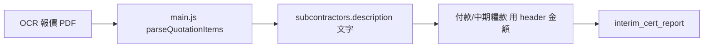

# BOQ Workflow

> **結論（code 證據）**：OSsysCU **沒有 BOQ 模組**。無 BOQ 資料表、無 BOQ API、無 line-item 進度計量驅動糧款。

---

## 系統實際儲存的金額層級 `[Code]`

| 層級 | 儲存位置 | 欄位 | 證據 |
|------|----------|------|------|
| 主合約總額 | `projects` | `contract_amount` | `database.py` init_db |
| 分判判項金額 | `subcontractors` | `contract_amount`, `contract_sum` | `database.py` |
| VO 加總 | `subcontractors` | `vo_amount` | `sync_sc_vo_amount()` |
| 主合約 FAC B/E/F/G | `projects` | `fac_remeasurement_b`, `fac_provisional_qty_e`, 等 | `main_fac.MAIN_FAC_MIGRATIONS` |

均為 **header-level 金額**，非 BOQ 行項目匯總。

---

## OCR / 報價解析（非 BOQ 入庫）`[Code]`

### 前端報價行解析

`frontend/js/main.js`：

- `parseQuotationItems(text)` — 解析「項次 / 項目描述 / 數量 / 單位 / 單價 / 金額」tab 分隔行
- `buildDescriptionText(items, title)` — 組裝工程描述文字

**用途**：OCR 結果顯示、寫入判項 `description` 欄。  
**未寫入**：獨立 BOQ 表。

### 後端 OCR

`ocr_processor.py` → `process_pdf()`：

- 發票：提取 line items → `payment_records` / 判項描述
- 報價：判項匹配、金額提取

**無** `parse_chinese_boq_items` 函數名出現在當前 `ocr_processor.py` 可見流程；報價行解析主要在前端 `main.js` 與 OCR extracted JSON。

---

## 主合約 FAC 與 BOQ 的關係 `[Code]`

`main_fac.build_main_con_fac()`：

| 行 | 欄 | 來源 |
|----|-----|------|
| A | `contract_amount` | 原始合約 |
| B | `fac_remeasurement_b` | **手填** |
| C | `supplemental_contract_amount` | 項目欄 |
| D | VO 匯總或 override | `_sc_vo_totals_for_project()` / `fac_variations_d_override` |
| E | `fac_provisional_qty_e` | **手填** |
| F | `fac_provisional_sums_f` | **手填** |
| G | `fac_fluctuations_g` | **手填** |

**證據**：`main_fac.py` L70–99 — 無 BOQ 計算引擎。

---

## 糧期與 BOQ `[Code]`

地盤 IP 累計 %：

```
application_pct = 累計 application_amount ÷ projects.contract_amount × 100
```

**證據**：`database.calc_ip_cumulative_pcts()` L3538–3554

分判中期糧款 A 行：若未手填，由淨付款反推，**非** BOQ 完成 %。

**證據**：`interim_cert_report.build_interim_cert_model()` L173–178

C 行 Material On Site：**固定 0** — `interim_cert_report.py` L141–142

---

## 工作流程圖（實際 code 路徑）



**不存在的路徑**：


---

## 相關但非 BOQ 的功能 `[Code]`

| 功能 | 說明 |
|------|------|
| 判項類型 M/SC/O | `main.js` → `refNoType()` — 費用分類，非 BOQ |
| Cover Page 結算 B/C | `project_cover.compute_settlement()` — 依 sc_no 前綴分組 |
| 工程分類 L1/L2 | `engineering_categories` — 項目分類，非 BOQ |

---

## `[Inferred]`

- 產品命名或 QS 慣例中「BOQ」可能指判項報價明細文字，但 code 不持久化為可計量的 BOQ 結構。
- 未來若加 BOQ，需新建表及 API；現有 `description` 欄不足支撐 line-item 糧款計算。

---

## 待辦文件引用（非 code）

`PENDING.md` 未列 BOQ 為待做項；`docs/匯報-20260814.md` 路線圖 Phase 1–6 亦無 BOQ 模組計劃。

---

## BOQ 決策文件（2026-08-14）

| 文件 | 用途 |
|------|------|
| [`BOQ Decision - QS Meeting Brief.md`](BOQ%20Decision%20-%20Meeting%20Brief.md) | QS 會議簡報、問題清單、決策矩陣 |
| [`BOQ Decision - Meeting Notes.md`](BOQ%20Decision%20-%20Meeting%20Notes.md) | 會議紀錄範本（會後勾選決策） |
| [`BOQ Decision - Lightweight Scope.md`](BOQ%20Decision%20-%20Lightweight%20Scope.md) | 若不做完整 BOQ 的加強範圍 |
| [`BOQ Module Design (Draft).md`](BOQ%20Module%20Design%20(Draft).md) | 若要做完整 BOQ 的 schema/API 草案 |

開放問題：[`Open Questions.md`](Open%20Questions.md) Q5.2
