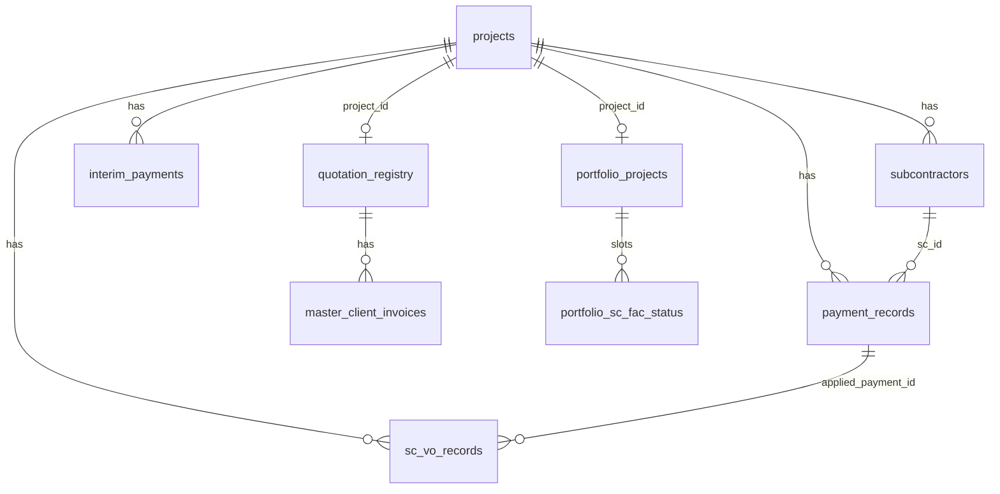
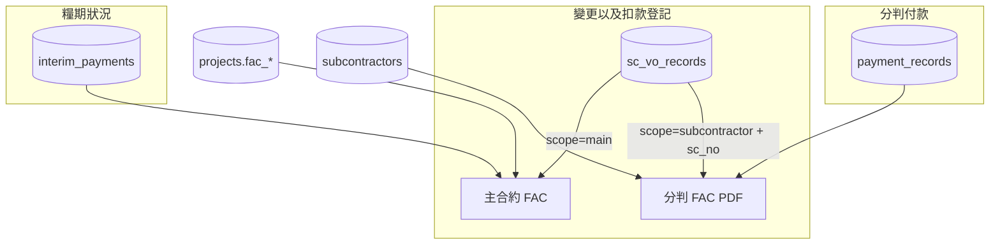

# Data Model

> Schema 定義集中於 `database.py`（`init_db()` + `_migrate_db()` 及子 migration）。  
> `PRAGMA foreign_keys = ON` — `get_conn()`

---

## 資料表清單（28 張）

### 核心業務

| 表名 | 主鍵 / 唯一鍵 | 用途 | 定義位置 |
|------|--------------|------|----------|
| `settings` | `key` PK | 系統設定 KV | `init_db()` |
| `projects` | `id` PK; `project_code` UNIQUE | 工程項目主檔 | `init_db()` + migrations |
| `subcontractors` | `id` PK; `UNIQUE(project_id, sc_no)` | 分判判項 | `init_db()` + `_migrate_db()` |
| `payment_records` | `id` PK | 付款登記 | `init_db()` + `_migrate_db()` |
| `interim_payments` | `id` PK; `UNIQUE(project_id, ip_no)` | 地盤糧期 | `init_db()` / `_migrate_db()` |
| `interim_payment_sc_lines` | `id` PK; `UNIQUE(project_id, ip_no, sc_no)` | 分包糧期矩陣 | `_migrate_db()` |

### VO / 扣款

| 表名 | 用途 | 定義位置 |
|------|------|----------|
| `sc_vo_records` | VO / 扣款明細 | `_migrate_db()` L577+ |
| `sc_vo_template_catalog` | 中期糧款模板目錄 | `_migrate_db()` L622+ |

### Master List

| 表名 | 用途 | 定義位置 |
|------|------|----------|
| `quotation_registry` | 報價／標書主檔 | `_migrate_db()` L270+ |
| `master_list_imports` | 匯入紀錄 | `_migrate_db()` L348+ |
| `master_subcon_summary` | 主分判摘要 | `_migrate_db()` L438+ |
| `master_qs_subcon_lines` | 分判明細行 | `_migrate_db()` L445+ |
| `master_client_invoices` | 業主發票 / IP | `_migrate_db()` L454+ |
| `master_subcon_payments` | 分判付款行 | `_migrate_db()` L466+ |
| `master_cheque_records` | 支票行 | `_migrate_db()` L476+ |
| `master_trade_categories` | 工作範疇 I/J 欄 | `_migrate_master_trade_categories()` |

### Ref / 登記

| 表名 | 用途 | 定義位置 |
|------|------|----------|
| `sc_contract_registry` | MS/C 分判合約編號 | `_migrate_db()` L303+ |
| `sc_contract_imports` | MS/C 匯入紀錄 | `_migrate_db()` L317+ |
| `engineering_categories` | 工程標準分類 L1/L2 | `_migrate_engineering_categories()` |

### 文件 / OCR

| 表名 | 用途 | 定義位置 |
|------|------|----------|
| `ocr_extractions` | OCR 結果 | `init_db()` |
| `sc_documents` | 判項附件 | `_migrate_db()` L248+ |
| `project_documents` | Cover Page 附件 | `_migrate_cover_page_fields()` |
| `iso_document_files` | ISO 槽位附件 | `_migrate_iso_documents()` |

### 全公司總表（V2）

| 表名 | 主鍵 / 唯一鍵 | 用途 | 定義位置 |
|------|--------------|------|----------|
| `portfolio_projects` | `id` PK; `project_id` UNIQUE | N 項目 FAC／進度表列 | `_migrate_portfolio_tables()` |
| `portfolio_sc_fac_status` | `id` PK; `UNIQUE(portfolio_project_id, slot_no)` | 分判 FAC 矩陣 1–15 槽 | `_migrate_portfolio_tables()` |
| `portfolio_imports` | `id` PK | FA／進度表 Excel 匯入紀錄 | `_migrate_portfolio_tables()` |

### 人員 / 關聯

| 表名 | 用途 | 定義位置 |
|------|------|----------|
| `staff_members` | 負責人名單 | `_migrate_db()` L402+ |
| `project_mp_contracts` | 同項目多 MP 合約 | `_migrate_cover_page_fields()` |

---

## 關鍵欄位（migration 增量）

### `projects` 重要欄 `[Code]`

| 欄 | 用途 | 來源 |
|----|------|------|
| `project_name_en`, `project_name_zh` | 雙語名稱 | `_migrate_db()` |
| `contract_amount` | 主合約承建金額 A | `init_db()` |
| `labour_allocation` | 人工分攤 | `_migrate_db()` |
| `ip_total_income`, `ip_total_expenditure`, `ip_advance` | 糧期匯總 | `_migrate_db()` |
| `quotation_no`, `person_code`, `person_in_charge` | Master 連結 | migration |
| `category_l1_code`, `category_l2_code` | 工程分類 | `_migrate_engineering_categories()` |
| `fac_*` 系列 | 主合約 FAC | `main_fac.MAIN_FAC_MIGRATIONS` |
| `fac_dlp_days`, `fac_dlp_expiry_date` | 主合約 FAC 保修期天數／到期日（2026-09-11） | `MAIN_FAC_MIGRATIONS` |
| `fac_lad_rate`, `fac_lad_max` | 延期罰款單價／限額 | `MAIN_FAC_MIGRATIONS` |
| `fac_testing_commission_date` | 測試調試完成日（UI 僅 N21／石鼓洲） | `MAIN_FAC_MIGRATIONS` |
| `fac_pc_cert_path`, `fac_mg_cert_path` | PC／修補缺陷證書附件 | `MAIN_FAC_MIGRATIONS` |
| `dlp_cert_date`, `dlp_period_months` | Cover 保修期起算／月數（DLP 衍生） | Cover migrations |

### `interim_payments` 重要欄 `[Code]`

| 欄 | 用途 |
|----|------|
| `ip_no`, `seq_no` | 糧款期數（`UNIQUE(project_id, ip_no)`） |
| `applied_date` | 申請日期 |
| `application_amount` | 美博申請付款 |
| `application_pct` | 申請 %（依承建金額累計計算） |
| `certified_income`, `certificate_date` | 業主批款／批款日期 |
| `ip_application_attachment`, `ip_application_attachment_name` | IP Application PDF（2026-09-11） |
| `ip_cert_attachment`, `ip_cert_attachment_name` | IP Cert. PDF |
| `receipt_*` | 收款記錄（支票／過數） |

> 附件實體檔：`DATA_DIR/uploads/`；路徑存 DB，經 `/api/interim-payments/{id}/…-attachment` 上傳。

### `subcontractors` 重要欄 `[Code]`

| 欄 | 用途 |
|----|------|
| `sc_no` | 判項編號（M-/SC-/O-） |
| `contract_amount`, `contract_sum` | 判項金額 |
| `vo_amount` | VO 加總（由 `sync_sc_vo_amount()` 同步） |
| `is_excluded` | 排除於 B 類匯總 |
| `retention_sum` | 保固金欄（存在；中期糧款未讀取 — 見 Calculation Rules） |
| `sub_contract_no` | MS/C 合約編號 |
| `trade_label` | 工種簡稱 |

### `payment_records` 重要欄 `[Code]`

| 欄 | 用途 |
|----|------|
| `payment_type` | `normal` / `interim_cert` |
| `vo_ids_json`, `deduction_ids_json` | 勾選 VO/扣款 ID 陣列 |
| `interim_cert_json` | 中期糧款 model snapshot |
| `deduction_total` | 扣款合計 |

### `sc_vo_records` 重要欄 `[Code]`

| 欄 | 用途 |
|----|------|
| `record_type` | `'vo'` / `'deduction'` |
| `ref_no` | VO-001 / CC-001 |
| `amount` | VO 正數；deduction 負數 |
| `applied_payment_id` | 套用至付款後鎖定 |
| `main_contract_vo_no` | 主合約變更編號 |
| `approval_attachment`, `quotation_attachment` | 分判：審批表 PDF、報價 PDF |
| `engineering_order_attachment`, `engineering_order_attachment_name` | 工程指令 PDF（2026-09-11） |
| `deduction_attachment`, `deduction_attachment_name` | 主合約扣款 PDF（`scope=main`） |
| `scope` | `'main'` 主合約列 · `'subcontractor'` 分判列（預設） |
| `sc_no` | 分判判項；主合約固定 `__MAIN__`（`SVR_MAIN_SC_NO`） |

---

## 模組資料關聯（2026-09-11 更新）`[Code]`

### 變更以及扣款登記 → `sc_vo_records`

| UI 區塊 | `scope` | `sc_no` | 主要附件欄 |
|---------|---------|---------|------------|
| 主合約變更以及扣款登記 | `main` | `__MAIN__` | `engineering_order_attachment` · `deduction_attachment` |
| 分判變更以及扣款登記 | `subcontractor` | SC-xxx | `approval_attachment` · `engineering_order_attachment` |

- API 篩選：`GET /api/projects/{id}/sc-vo-records?scope=main|subcontractor`
- 主合約 FAC 匯總 VO／扣款：`_sc_vo_totals_for_project()` 只計 `scope=main` 或 `sc_no=__MAIN__`
- 分判 FAC：`_sc_vo_for_sc()` 依判項 `sc_no` 配對（含 `SC-004.1` 子編號）

### 糧期狀況 → `interim_payments`

```
projects (1) ──< interim_payments (N 期)
                    ├── ip_application_attachment  → 美博申請側文件
                    ├── ip_cert_attachment         → 業主批款側文件
                    └── receipt_attachment         → 收款憑證
```

- 列表／編輯：`ip_period.js` ↔ `GET/PUT /api/interim-payments`
- 與分判付款無 FK；分包支出由 `payment_records` 另線匯總

### 主合約最終結算 → `projects` + 衍生

```
projects.fac_*  ──write──>  main_con_fac.js / PUT project
        │
        ├── build_main_con_fac()  ← sc_vo_records (scope=main)
        ├──                     ← interim_payments (糧期匯總)
        └── main_con_fac_pdf.py  → PDF（不落庫，即時生成）
```

| 資料來源 | 用途 |
|----------|------|
| `projects.contract_amount`, `fac_*` | A–K 結算欄、關鍵日期 |
| `project_documents` / `fac_pc_cert_path` 等 | PC／MG 證書附件 |
| `sc_vo_records`（main） | D 變更、J 扣款匯總 |
| `interim_payments` | I 已付匯總（可 override） |

### 分判最終結算 → 衍生 payload（無獨立 FAC 表）

```
subcontractors ──┬── sc_vo_records (record_type=vo|deduction, 配 sc_no)
                 ├── payment_records (paid_amount, 配 sc_no)
                 └── sc_contract_registry (MS/C 編號對齊)
                          │
                          ▼
                   build_sc_fac()  →  JSON payload
                          │
                          ▼
                   sc_fac_pdf.py   →  P1 結算+內部簽
                                   →  P2 結算+SC_FAC_DECLARATIONS+雙簽
                                   →  附錄 I (variations)
                                   →  附錄 II (contra_charges)
```

| 結算表列 | 資料來源 |
|----------|----------|
| 合約價 | `subcontractors.contract_amount` |
| 加減工程 | `sc_vo_records` 中 `record_type=vo` 加總 |
| 扣款行 | `record_type=deduction` → `settlement.deduction_lines` |
| 已付 | `payment_records.paid_amount` 加總（未 revoke） |
| 尾期 IP 標籤 | `count_interim_certs_for_sc()` → IP 期數 |

> **P2 三段聲明**存於程式常數 `sc_fac_pdf.SC_FAC_DECLARATIONS`（非 DB）。  
> **簽署日期／已簽 PDF** 尚未寫回 DB（規劃：`subcontractors.sc_fac_signed_date` 或獨立 signoff 表）。

---

## 外鍵關係 `[Code]`

```
projects (id)
  ├── subcontractors.project_id          ON DELETE CASCADE
  ├── payment_records.project_id         ON DELETE CASCADE
  ├── interim_payments.project_id        ON DELETE CASCADE
  ├── interim_payment_sc_lines.project_id ON DELETE CASCADE
  ├── sc_vo_records.project_id           ON DELETE CASCADE
  ├── sc_documents.project_id            ON DELETE CASCADE
  ├── iso_document_files.project_id      ON DELETE CASCADE
  ├── project_documents.project_id       ON DELETE CASCADE
  └── project_mp_contracts.project_id    ON DELETE CASCADE
  └── portfolio_projects.project_id      ON DELETE CASCADE

portfolio_projects (id)
  └── portfolio_sc_fac_status.portfolio_project_id ON DELETE CASCADE

subcontractors (id)
  ├── payment_records.sc_id              ON DELETE SET NULL
  └── sc_documents.sc_id                 ON DELETE SET NULL

payment_records (id)
  ├── ocr_extractions.payment_id         ON DELETE SET NULL
  └── sc_vo_records.applied_payment_id   ON DELETE SET NULL

quotation_registry (quotation_no)
  ├── master_subcon_summary.quotation_no
  ├── master_qs_subcon_lines.quotation_no
  ├── master_client_invoices.quotation_no
  ├── master_subcon_payments.quotation_no
  └── master_cheque_records.quotation_no
  （均 ON DELETE CASCADE）

quotation_registry.project_id → projects(id) ON DELETE SET NULL
```

---

## 邏輯關係（無 FK 宣告）`[Code]`

| 關係 | 機制 | 函數 |
|------|------|------|
| 付款 ↔ VO | `payment_records.vo_ids_json` → `sc_vo_records.id` | `_apply_payment_sc_vo_records()` |
| 糧期 SC 矩陣 | `interim_payment_sc_lines.ip_no` 文字配對 `interim_payments.ip_no` | `build_ip_sc_matrix()` |
| Master ↔ 項目 | `quotation_registry.project_id` + `quotation_no` | `link_quotation_to_project()`, `master_link.find_project_for_quotation()` |
| MS/C ↔ 項目 | `sc_contract_registry.project_core` ↔ `projects.project_code` | `sc_contract_ref.resolve_sub_contract_no()` |
| 工程分類 | `projects.category_l2_code` → `engineering_categories.l2_code` | 僅索引，無 FK |
| VO 主／分判 | `sc_vo_records.scope` + `sc_no` | `get_sc_vo_records(scope=…)` · `SVR_MAIN_SC_NO` |
| 主合約 FAC ↔ VO | main 範圍 VO/扣款 | `_sc_vo_totals_for_project()` |
| 分判 FAC ↔ 判項 | VO/扣款/付款依 `sc_no` 配對 | `build_sc_fac()` · `_sc_vo_for_sc()` |
| 糧期附件 | `interim_payments.*_attachment` → uploads | `app.py` attachment routes |
| N 項目 FA 分判槽 | `portfolio_sc_fac_status.subcontractor_id` → `subcontractors.id` | 僅名稱／狀態；與 SC FAC PDF **未連動** |

> **注意**：`sc_vo_records.sc_id` 欄位存在，但 CREATE TABLE 未宣告 FK 至 `subcontractors`。

---

## ER 概覽





---

## 編號對照 `[Code]`

| 格式 | 示例 | 模組 |
|------|------|------|
| Master List 報價 | `MS/Q1241/24/kp` | `master_ref.py`, `quotation_registry.quotation_no` |
| 分判項目 core | `MS_Q1241_24_kp` | `sc_contract_ref._project_core()` |
| MS/C 合約 | `MS/C12-7/24/dc` | `sc_contract_registry.sub_contract_no` |
| MP 合約 | `Q1241_24`（衍生） | `project_cover.derive_mp_contract_code()` |

配對優先序（Master → 項目）：`master_link.find_project_for_quotation()` — project_code → quotation_no → MP → mp_contracts → project_core。

---

## 不存在 `[Code]`

- **BOQ 表**：全 schema 無 line-item BOQ
- **Audit log 表**
- **subcontractor_companies 主檔表**
- **users / sessions 表**
