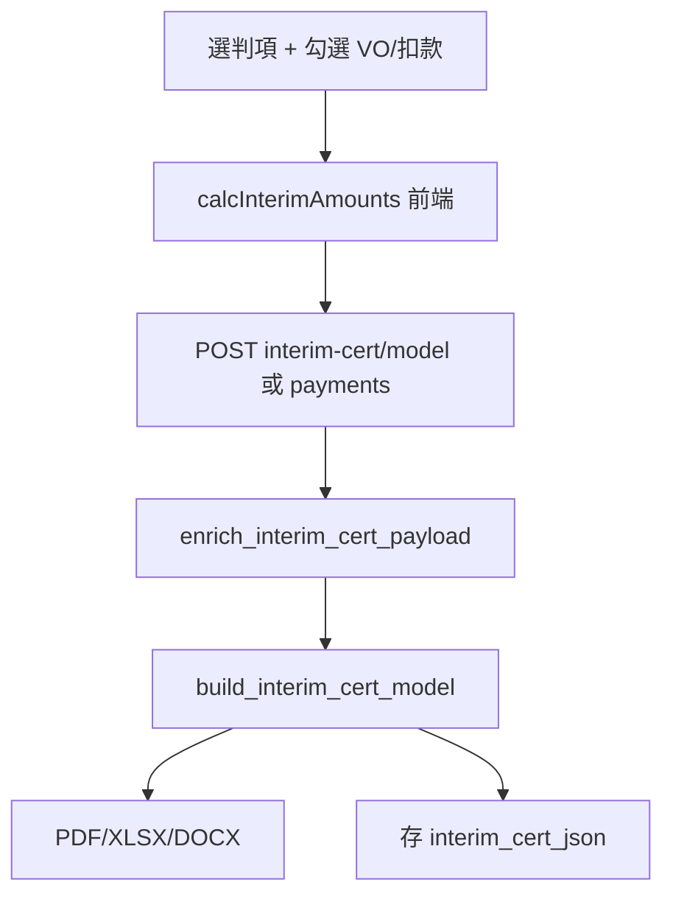

# Progress Payment Workflow

> 系統有 **兩條獨立的 Progress Payment 線**：地盤主合約糧期（業主 IP）與分判中期糧款計算書（Interim Cert）。  
> 兩者 **不共用 BOQ 完成百分比**。

---

## A. 地盤主合約糧期（業主 IP）

### 資料表 `[Code]`

| 表 | 用途 |
|----|------|
| `interim_payments` | 每期 IP：申請額、核證收入、分判付款等 |
| `interim_payment_sc_lines` | 判項 × IP 矩陣金額 |
| `projects.ip_total_income` 等 | 匯總欄 |

### API `[Code]`

| 端點 | 用途 |
|------|------|
| `GET /api/projects/<id>/interim-payments` | 糧期摘要 |
| `POST/PUT/DELETE /api/interim-payments` | CRUD |
| `PUT /api/projects/<id>/interim-payments/meta` | 項目級 meta |
| `POST/DELETE .../receipt-attachment` | 支票收據 |
| `POST/DELETE .../ip-cert-attachment` | IP 證書 |
| `GET /api/projects/<id>/ip-sc-drilldown` | 矩陣 cell 明細 |
| `GET /api/projects/<id>/ip-reconciliation` | 地盤 vs 行政 |

### 前端 `[Code]`

- **頁面**：糧期狀況 — `ip_period.js`
- **子功能**：分包矩陣、糧期核對 — `ip_reconcile.js`（唯讀渲染，無獨立 API）

### 資料來源 `[Code]`

1. **Excel 匯入**：`excel_importer_payment.import_site_ip_period()` 讀 Payment Status Table `Summary` sheet  
2. **手動編輯**：`IpPeriod` modal CRUD

### 累計百分比 `[Code]`

```python
# database.calc_ip_cumulative_pcts(items, contract_amount)
cum_app += application_amount
application_pct = cum_app / contract_amount * 100  # 同理 certified_income_pct
```

**分母**：`projects.contract_amount`（承建金額）  
**證據**：`database.py` L3538–3554

### 匯總至項目 `[Code]`

Excel 匯入後寫入 `projects.ip_total_income`, `ip_total_expenditure`, `ip_advance` — `excel_importer_payment.py`

### 主合約 FAC 引用 `[Code]`

`main_fac.build_main_con_fac()`：

- I（已付）：預設 `ip_total_income` 或 `SUM(interim_payments.certified_income)`
- 可覆寫：`fac_total_paid_i_override`

**證據**：`main_fac.py` L87–92

---

## B. 分判中期糧款計算書（Interim Cert）

### 資料表 `[Code]`

| 表 / 欄 | 用途 |
|---------|------|
| `payment_records` | `payment_type='interim_cert'` |
| `payment_records.interim_cert_json` | model snapshot |
| `payment_records.vo_ids_json`, `deduction_ids_json` | 勾選 VO/扣款 |
| `sc_vo_records.applied_payment_id` | 套用鎖定 |

### API `[Code]`

| 端點 | 用途 |
|------|------|
| `POST /api/payments/interim-cert/model` | 建立計算 model |
| `POST /api/payments/interim-cert/pdf` | 預覽 PDF |
| `POST /api/payments/interim-cert/xlsx` | Excel |
| `POST /api/payments/interim-cert/docx` | Word |
| `GET /api/payments/<id>/interim-cert/pdf` | 依已存記錄輸出 |
| `POST /api/payments` | 儲存付款 + cert json |

### 前端 `[Code]`

- **頁面**：分判付款登記 → 付款登記 tab
- **模組**：`payments.js`
  - `onPayTypeChange()` — 切換 normal / interim_cert
  - `calcInterimAmounts()` — 金額聯動
  - `_buildInterimPayload()` — 組裝 API payload

### 計算流程 `[Code]`



| 步驟 | 函數 | 檔案 |
|------|------|------|
| 補上期狀態 | `get_previous_interim_state()` | `database.py` |
| enrich payload | `enrich_interim_cert_payload()` | `interim_cert_report.py` |
| 組裝行項目 | `build_interim_cert_model()` | `interim_cert_report.py` |
| 保固金累計 | `_retention_cumulative()` | `interim_cert_report.py` L112–117 |
| 輸出 PDF | `generate_interim_cert_pdf()` | `interim_cert_report.py` |

### 行項目規則摘要 `[Code]`

| 行 | 規則 |
|----|------|
| B | 今期勾選 VO `amount` 加總 |
| 扣款 | 勾選 deduction，負數 |
| 標準行 | CP&FM、徵稅等 — `get_cert_standard_lines()` |
| 保固金 | 按 `sc_total × retention_pct` 上限累計（負數）；預設 pct=**0.05** |
| C (MOS) | **固定 0** |
| A | 未手填則反推：`net − B − Ret − deductions − standard` |
| 總計 | Sub-total(A+B) + 保固金 + 扣款 + 標準行 |

**證據**：`interim_cert_report.py` L120–180；`payments.js` L653 `retention_pct: 0.05`

### 合約總承包價 `[Code]`

```
sc_total = sc_contract_sum + vo_amount
```

前端：`payments.js` `calcInterimAmounts()` L476–478  
後端：`interim_cert_report.build_interim_cert_model()` L124–126

---

## C. 分判 FAC 尾期（相關但非 IP）

`sc_fac.build_sc_fac()`：

```
final_sum = original + vo_total
outstanding = final_sum - total_paid - deduction_total
```

**頁面**：分判最終結算 — `sc_fac.js`  
**輸出**：`GET .../sc-fac/pdf`, `.../docx`

---

## D. Master List 行政糧期（對照用）

`GET /api/master/item/.../ip-reconcile` → `master_ip_reconcile.py`  
與地盤 IP **唯讀對照**，不覆寫地盤資料。

**前端**：`ip_reconcile.js` — 狀態 badge「僅行政／僅地盤」為對帳標籤，非使用者角色。

---

## 兩線對照

| 維度 | 地盤 IP | 分判 Interim Cert |
|------|---------|-------------------|
| 主體 | 業主糧期 | 分判商糧款 |
| 表 | `interim_payments` | `payment_records` |
| 驅動 | Excel / 手動金額 | VO + 模板 + 反推 A |
| % 計算 | ÷ `contract_amount` | 無 BOQ % |
| PDF | IP Cert 附件 | 中期糧款計算書 |

---

## 未完成（code / PENDING 交叉）`[Code]`

- `retention_sum`（`subcontractors` 欄）未接入 `interim_cert_report` — `PENDING.md` L42–43
- C 行 Material On Site 恒 0 — `interim_cert_report.py` L141–142

---

## `[Inferred]`

- 地盤 IP 與分判 Interim Cert 在 Excel 地盤表中可能同 sheet 不同區塊，但 code 分表儲存、無自動對平。
