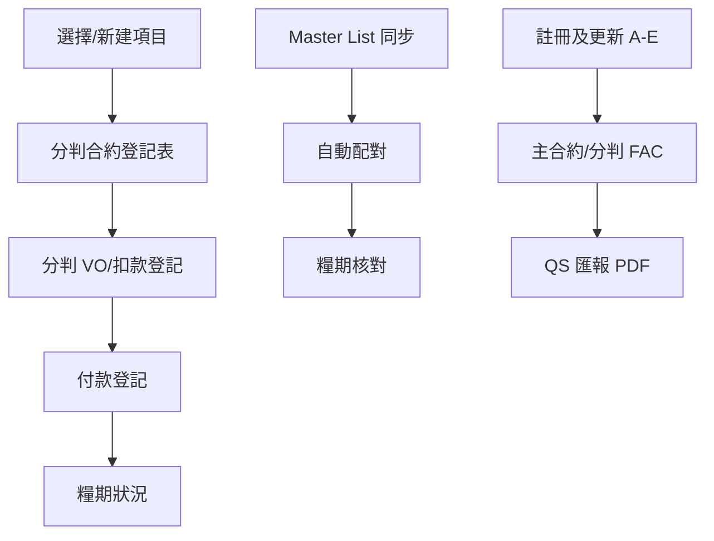

# Screen and Route Map

> 前端為 **客戶端 SPA 路由**（非 server-side route）。  
> 後端 API 前綴均為 `/api`。

---

## 前端頁面對照

### 側欄 — 主要功能（需選項目）

| 側欄標籤 | `data-page` | DOM `#page-*` | JS 模組 | 證據 |
|----------|-------------|---------------|---------|------|
| 項目概覽 | `dashboard` | `page-dashboard` | `Dashboard`（`main.js`） | `index.html` L50 |
| ISO 文件 | `iso-docs` | `page-iso-docs` | `IsoDocs`（`iso_docs.js`） | L53 |
| 分判付款登記 | `payments` | `page-payments` | `Payments`（`payments.js`） | L56 |
| 分判變更以及扣款登記 | `sc-vo-reg` | `page-sc-vo-reg` | `ScVoReg`（`sc_vo_reg.js`） | L60 |
| 糧期狀況 | `ip-period` | `page-ip-period` | `IpPeriod`（`ip_period.js`） | L63 |
| 最終結算 | `main-con-fac` | `page-main-con-fac` | `MainConFac`（`main_con_fac.js`） | L66 |
| 分判最終結算 | `sc-fac` | `page-sc-fac` | `ScFac`（`sc_fac.js`） | L69 |
| 發票 / 報價上傳 | `ocr` | `page-ocr` | `OCR`（`ocr.js`） | L72 |
| 財務報表 | `reports` | `page-reports` | `Reports`（`reports.js`） | L75 |

### 側欄 — 管理（全域）

| 側欄標籤 | `data-page` | JS 模組 | 證據 |
|----------|-------------|---------|------|
| 工程項目 | `projects` | `Projects`（`projects.js`） | `index.html` L80 |
| Master List | `master-list` | `MasterList`（`master_list.js`） | L83 |
| 分判合約編號 | `sc-contract-registry` | `ScContractRegistry`（`sc_contract_registry.js`） | L86 |
| 項目負責人管理 | `staff` | `StaffRoster`（`staff.js`） | L89 |
| 系統設定 | `settings` | `Settings`（`main.js`） | L92 |

### 非側欄頁面

| 頁面 | `data-page` | 進入方式 | 證據 |
|------|-------------|----------|------|
| 註冊及更新 | `project-settlement` | 工程項目 →「註冊及更新」 | `main.js` → `navigate()` titles L1004 |

---

## 路由機制 `[Code]`

- 入口：`App.navigate(page, options)` — `frontend/js/main.js`
- 顯示邏輯：隱藏所有 `.page`，顯示 `#page-{page}`，更新 `.nav-item.active`
- 項目 ID 持久化：`localStorage` key `qs_project_id` — `App.selectProject()`

### 路由別名 `[Code]`

| 舊名 | 重定向 | 證據 |
|------|--------|------|
| `subcontractors` | `payments`（可帶 `tab: 'sc'`） | `main.js` L977–980 |
| `sc-vo` | `sc-vo-reg` | `main.js` L982 |

---

## 頁內子區塊

### 分判付款登記 `[Code]`

| Tab / 面板 | 用途 | 證據 |
|------------|------|------|
| 分判合約登記表 | M/SC/O 判項 CRUD | `payments.js` / `projects.js` SC |
| 付款登記 | 發票 / 中期糧款 | `payments.js` |

### 糧期狀況 `[Code]`

| 區塊 | 用途 | JS |
|------|------|-----|
| 地盤糧期主表 | IP 編輯 | `ip_period.js` |
| 分包糧期矩陣 | SC × IP | `ip_period.js` |
| 糧期核對 | 地盤 ↔ 行政 | `ip_reconcile.js` |

### Master List 模態框 `[Code]`

財務明細分頁：IP / 核對 / QS / 分判 / 支票 — `master_list.js`

---

## 項目切換連動 `[Code]`

`App.selectProject(id)` 並行刷新：

- `Dashboard.load`, `Payments.load`, `SC.load`, `IpPeriod.load`, `Reports.load`

若當前 active 頁為 `iso-docs` / `sc-vo-reg` / `main-con-fac` / `sc-fac`，額外 reload 對應模組。

**證據**：`main.js` → `_refreshProjectViews()` L956–974

---

## 後端 API 路由分組

### 靜態 `[Code]`

| 路徑 | 用途 |
|------|------|
| `GET /` | `index.html` |
| `GET /css/<path>`, `/js/<path>`, `/assets/<path>` | 靜態資源 |

### 業務 API（節錄）

| 前綴 | 主要方法 | Handler 位置 |
|------|----------|--------------|
| `/api/settings` | GET, POST | `app.py` |
| `/api/projects` | GET, POST, PUT, DELETE | `app.py` |
| `/api/company-summary` | GET | `app.py` |
| `/api/subcontractors` | GET, POST, DELETE | `app.py` |
| `/api/payments` | GET, POST, PUT, DELETE | `app.py` |
| `/api/payments/interim-cert/model` | POST | `app.py` → `interim_cert_report` |
| `/api/payments/interim-cert/pdf` | POST | 同上 |
| `/api/sc-vo-records` | GET, POST, PUT, DELETE | `app.py` |
| `/api/interim-payments` | GET, POST, PUT, DELETE | `app.py` |
| `/api/reports/summary/<id>` | GET | `app.py` → `get_project_summary` |
| `/api/reports/boss-pdf/<id>` | GET | `app.py` → `qs_report_pdf` |
| `/api/master/*` | 多種 | `app.py` |
| `/api/staff` | GET, POST, PUT, DELETE | `app.py` |
| `/api/ocr/upload` | POST | `app.py` → `ocr_processor` |
| `/api/import/excel` | POST | `app.py` → `excel_importer` |
| `/api/system/status` | GET | `app.py` |

完整清單：`app.py` 內所有 `@app.route`（約 136 條）。

---

## User Flow（code 可追蹤路徑）

| 流程 | API / 函數鏈 |
|------|-------------|
| 項目建立 | `POST /api/projects` 或 `POST /api/import/excel` |
| 判項 | `POST /api/subcontractors` |
| VO | `POST /api/projects/<id>/sc-vo-records` |
| 付款 | `POST /api/payments` |
| 中期糧款 PDF | `POST /api/payments/interim-cert/pdf` |
| 地盤 IP | `POST /api/interim-payments` |
| QS PDF | `GET /api/reports/boss-pdf/<id>` |

---

## UI 權限隱藏

**無**依 `access_role` 隱藏 nav 或頁面的 code。

**證據**：`index.html` 側欄固定列出全部項目；`staff.js` 角色 badge 標「預留權限」。
