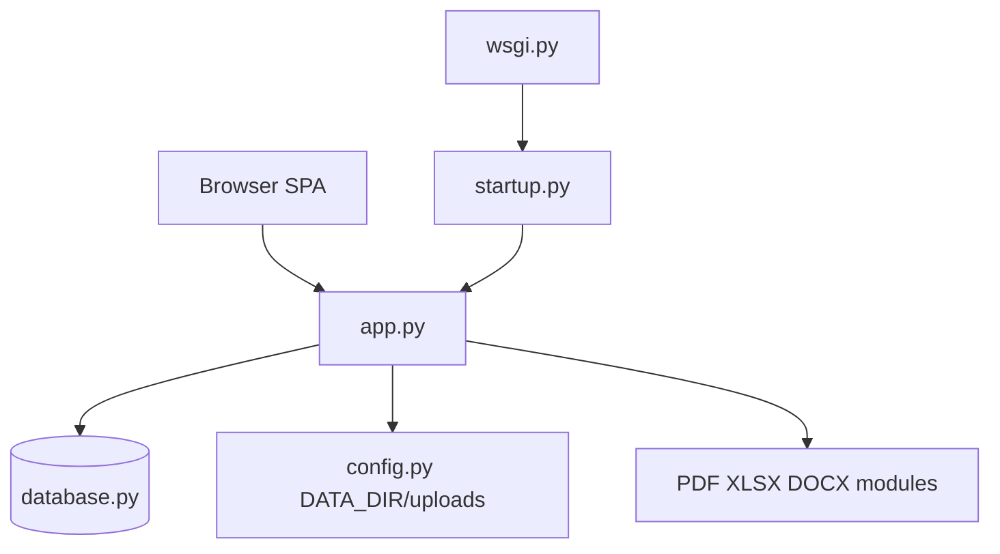

# System Overview

> **版本**：`20260813-eng-cat`（`startup.APP_VERSION`）  
> **分析日期**：2026-08-14  
> **方法**：唯讀 code 分析；不含密碼、Token 或客戶敏感資料

---

## 定位

OSsysCU 為 **QS 地盤付款管理系統**：Flask API + SQLite + 靜態 SPA 前端。核心涵蓋工程項目、Master List 報價、分判判項／付款、地盤糧期、VO／扣款、主／分判最終結算、OCR、財務報表 PDF。

**證據**：`app.py` 模組說明、`frontend/index.html` 標題與側欄導航。

---

## 技術架構

| 層 | 技術 | 證據 |
|----|------|------|
| 後端 | 單體 Flask，`app.py` 約 136 條 `@app.route`，**無 Blueprint** | `app.py` |
| 前端 | 靜態 SPA；客戶端路由 `App.navigate()` | `frontend/js/main.js` |
| 資料庫 | SQLite；`PRAGMA foreign_keys=ON` | `database.py` → `get_conn()` |
| WSGI | Gunicorn 入口 | `wsgi.py` → `startup.run()` → `from app import app` |
| API 回應 | `{ success, data/error }` | `app.py` → `resp()` |
| CORS | 全局開啟 | `app.py` → `CORS(app)` |

---

## 部署與資料路徑

| 項目 | 說明 | 證據 |
|------|------|------|
| 本機 | `DATA_DIR = BASE_DIR`（repo 根目錄） | `config.py` → `_resolve_data_dir()` |
| Docker / Zeabur | 偵測 `/.dockerenv` → `DATA_DIR = '/data'` | `config.py` |
| 資料庫 | `DB_PATH = {DATA_DIR}/qs_system.db` | `config.py` |
| 上傳 | `UPLOAD_DIR = {DATA_DIR}/uploads` | `config.py` |
| Legacy 遷移 | 舊 `/app` 路徑啟動時搬到 `/data` | `config.py` → `migrate_legacy_data()` |
| 版本查詢 | `GET /api/system/status` → `app_version` | `app.py` → `system_status()` |

---

## 啟動流程

`startup.run()` 執行：

1. `migrate_legacy_data()`  
2. `db.init_db()`  
3. 背景 thread：空庫 Excel 匯入、sc_contract / engineering_categories / master_trade 同步、PDF 字型預載  

**證據**：`startup.py` → `run()`, `_sync_excel_background()`, `_sync_sc_contract_background()`, `_preload_pdf_font()`

---

## OCR 管線

優先序（code 註解）：

1. pdfplumber / PyMuPDF — 可搜尋 PDF 文字  
2. RapidOCR (ONNX) — CPU OCR  
3. Quark Vision — 可選  
4. Gemini Vision — 可選 API Key  

**證據**：`ocr_processor.py` 檔頭說明、`process_pdf()` 流程

---

## 認證與安全（code 現況）

| 項目 | 現況 | 證據 |
|------|------|------|
| 使用者登入 | **未實作**（無 session、無 login route） | `app.py` 全檔 |
| 角色 enforce | **未實作**（`access_role` 僅存 DB） | `database.py`, `staff.js` |
| 維運 Token | `RESTORE_TOKEN` 保護 DB/uploads 還原；`SYNC_TOKEN` 保護 Excel sync | `app.py` → `restore_database()`, `sync_excel_api()` |
| Token 設定狀態 | `/api/system/status` 回傳 `restore_token_configured: bool`（不含值） | `app.py` → `system_status()` |

> **Inferred**：生產環境若未設 Token，還原端點行為依空庫／非空庫分支而定；一般業務 API 無 auth 中介層。

---

## 主要後端模組

| 模組 | 職責 |
|------|------|
| `app.py` | 全部 HTTP 路由 |
| `database.py` | Schema、migration、CRUD、匯總 |
| `excel_importer_payment.py` | 地盤 Payment Status Table → DB |
| `master_list_importer.py` | Master List Excel 同步 |
| `summary_importer.py` | Summary.xlsx → 工程項目 |
| `sc_contract_importer.py` | MS/C Ref → `sc_contract_registry` |
| `interim_cert_report.py` | 中期糧款 PDF/XLSX/DOCX |
| `main_fac.py` / `sc_fac.py` | 主／分判最終結算 |
| `qs_report_pdf.py` | QS 地盤財務匯報 PDF |
| `master_link.py` | Master ↔ 項目自動配對 |
| `sc_contract_ref.py` | MS/C 編號解析 |
| `project_cover.py` | Cover Page、結算 A–E（Cover 版） |
| `ocr_processor.py` | OCR 管線 |

---

## 非 BOQ 系統

全 repo **無 BOQ 資料表、無 BOQ API**。判項金額為 header-level 登記，非 line-item 計量。

**證據**：`database.py` schema；`subcontractors.contract_amount` / `contract_sum` 欄位；中期糧款 `interim_cert_report.py` 無 BOQ 引用。
