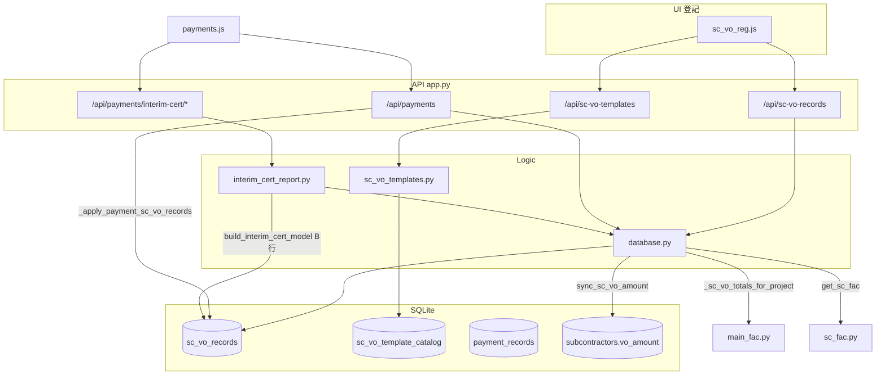
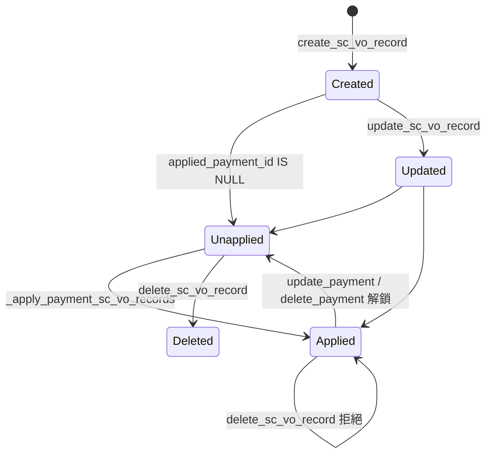

# VO 模組 — 完整技術流程

> **範圍**：分判變更工程（VO）與扣款（deduction）登記、模板、套用至中期糧款、匯總至判項／FAC。  
> **分析日期**：2026-08-14  
> **方法**：僅記錄 code 中有證據的行為；不含 Token／密碼／客戶資料。

---

## 1. 模組邊界

| 層 | 檔案 | 職責 |
|----|------|------|
| UI 登記頁 | `frontend/js/sc_vo_reg.js` | 矩陣列表、新增／編輯 modal、模板管理、CSV 匯出 |
| UI 套用 | `frontend/js/payments.js` | 中期糧款勾選 VO／扣款、計算書預覽／提交 |
| API | `app.py` L791–930 | `/api/sc-vo-*` 路由 |
| 模板服務 | `sc_vo_templates.py` | 內建種子、目錄快取、`cert_label_for_record()` |
| 資料／業務 | `database.py` | CRUD、`sync_sc_vo_amount()`、付款鎖定 |
| 計算書 | `interim_cert_report.py` | B 行 VO 加總、`enrich_interim_cert_payload()` |
| 主合約 FAC | `main_fac.py` + `database._sc_vo_totals_for_project()` | 項目級 D／J 匯總 |
| 分判 FAC | `sc_fac.py` + `database.get_sc_fac()` | 判項級 VO 附錄、outstanding |

**無獨立 Service 層**：API handler 直接呼叫 `database.py` 與 `sc_vo_templates.py`。

---

## 2. 端到端資料流



---

## 3. 記錄狀態流程

### 3.1 `sc_vo_records` 生命週期



| 狀態 | DB 條件 | UI 表現 | 證據 |
|------|---------|---------|------|
| 未套用 | `applied_payment_id IS NULL` | badge「未套用」；刪除按鈕可用 | `sc_vo_reg.js` L175–177 |
| 已套用 | `applied_payment_id` 有值 | badge「已套用 #id」；刪除 `disabled` | `sc_vo_reg.js` L174–176 |
| 鎖定刪除 | 已套用時 DELETE | API 400：`已套用於糧款計算書，不能刪除` | `database.delete_sc_vo_record()` L3414–3416 |

**套用時機**：`create_payment()` / `update_payment()` 成功後呼叫 `_apply_payment_sc_vo_records()` — `database.py` L2868、L2910。

**解鎖時機**：
- `update_payment()` 先 `UPDATE sc_vo_records SET applied_payment_id=NULL WHERE applied_payment_id=?` — L2906–2908
- `delete_payment()` 同上 — L3460–3462

**注意**：`update_sc_vo_record()` **未**檢查 `applied_payment_id`；已套用記錄仍可在 API 層被 PUT 更新（`database.py` L3353–3381）。

### 3.2 判項 `vo_amount` 同步

僅 **`record_type='vo'`** 觸發 `sync_sc_vo_amount()`：

| 事件 | 函數 | 證據 |
|------|------|------|
| 新增 VO | `create_sc_vo_record()` 末尾 | L3347–3348 |
| 更新任意記錄 | `update_sc_vo_record()` 末尾 | L3378–3380 |
| 刪除 VO | `delete_sc_vo_record()` 若 `record_type=='vo'` | L3420–3421 |

```python
# database.sync_sc_vo_amount(project_id, sc_no)
# subcontractors.vo_amount = SUM(sc_vo_records.amount) WHERE record_type='vo'
```

證據：`database.py` L3063–3073、`sum_sc_vo_amount()` L3053–3060。

扣款（deduction）**不**寫入 `subcontractors.vo_amount`。

---

## 4. 權限

| 項目 | Code 現況 | 證據 |
|------|-----------|------|
| 登入／Session | **無** | `app.py` 全檔無 `@login_required` |
| 角色 enforce | **無** | `staff_members.access_role` 不參與 VO 路由 |
| 所有 `/api/sc-vo-*` | 公開可呼叫 | 同其他業務 API |
| 附件上傳 | 允許 `pdf/png/jpg/jpeg` | `app.py` `allowed_file()` L22–26、`upload_sc_vo_attachment()` L910–911 |

---

## 5. UI 層

### 5.1 登記頁 — `ScVoReg`（`sc_vo_reg.js`）

**入口**：側欄 `data-page="sc-vo-reg"` → `App.navigate('sc-vo-reg')` — `frontend/index.html` L60、`main.js` L1024。

**前置**：需 `App.currentProject`；否則 `renderEmpty()` — L17–19。

| 操作 | 函數 | API |
|------|------|-----|
| 載入列表 | `load()` | `GET /projects/{id}/sc-vo-records[?sc_no=]` |
| 載入模板 | `ensureTemplates()` | `GET /sc-vo-templates` |
| 建議編號 | `suggestRefNo()` | `GET .../sc-vo-records/next-ref?sc_no=&record_type=` |
| 新增 | `saveModal()` POST | `POST /projects/{id}/sc-vo-records` |
| 編輯 | `saveModal()` PUT | `PUT /sc-vo-records/{id}` |
| 刪除 | `delete()` | `DELETE /sc-vo-records/{id}` |
| VO 附件 | `_uploadPendingFiles()` | `POST /sc-vo-records/{id}/upload`（僅 `record_type==='vo'`） L452–454 |
| 模板 CRUD | `saveTplForm()` 等 | `/api/sc-vo-templates` |
| CSV | `exportCsv()` | 純前端 |

**前端驗證**（未送 API 前）：

| 規則 | 訊息 | 證據 |
|------|------|------|
| 無項目 | `請先選擇項目` | L433 |
| 無判項 | `請選擇判項編號` | L435 |
| 無金額 | `請輸入變更金額` / `扣款金額` | L436–438 |

**列表篩選**：`svrFilterSc`、`svrFilterType`（vo/deduction）、`svrSearch` — `applyFilters()` L103–111。

**儲存後副作用**：刷新 `App.scList`（`GET /subcontractors`）、`Payments.populateScFilter()` — L457–460。

### 5.2 中期糧款套用 — `Payments`（`payments.js`）

**入口**：分判付款登記 → 付款 modal → `payment_type='interim_cert'`。

| 操作 | 函數 | API |
|------|------|-----|
| 載入可勾選項 | `loadScVoPickList()` | `GET .../sc-vo-records?sc_no=&unapplied=1` L511–516 |
| 載入標準行模板 | `ensureCertTemplates()` | `GET /sc-vo-templates`（`source=cert_standard`） L435–439 |
| 預覽 model | `goInterimPreview()` | `POST /payments/interim-cert/model` L757 |
| 提交並鎖定 | `submitInterimCert()` | `POST/PUT /payments` 帶 `vo_ids`, `deduction_ids` L772–795 |
| 打印 PDF | `printInterimCert()` | `POST /payments/interim-cert/pdf` L808 |

**勾選規則**（UI 文案）：`[VO]→B 行 · [扣款/減]→減:列` — L573。

**前端 VO 相關計算**：

```javascript
// payments.js
_getVoProvisionalTotal()  // 勾選 VO amount 加總 — L416-418
calcInterimAmounts()        // totalContract = contract + vo_amount — L476-478
_buildInterimCertPayload()  // vo_ids, vo_items, retention_pct: 0.05 — L607-669
```

---

## 6. API 層（`app.py`）

### 6.1 模板 `/api/sc-vo-templates`

| 方法 | Handler | DB / 服務 | 錯誤 |
|------|---------|-----------|------|
| GET | `sc_vo_templates_api()` L791 | `manage=1` → `list_all_templates()`；否則 `all_templates()` | — |
| POST | `create_sc_vo_template_api()` L799 | `upsert_sc_vo_template_catalog()` | 400 `ValueError` |
| PUT | `update_sc_vo_template_api()` L811 | 同上 | 400 |
| DELETE | `delete_sc_vo_template_api()` L822 | `delete_sc_vo_template_catalog()` | 400 |

### 6.2 記錄 `/api/sc-vo-records`、 `/api/projects/.../sc-vo-records`

| 方法 | 路徑 | Handler | 錯誤回應 |
|------|------|---------|----------|
| GET | `/projects/{id}/sc-vo-records` | `get_sc_vo_records_api()` L831 | — |
| GET | `.../next-ref` | `suggest_sc_vo_ref_api()` L842 | 400 缺 sc_no；400 record_type 非法 |
| POST | `/projects/{id}/sc-vo-records` | `create_sc_vo_record_api()` L855 | 400 缺 sc_no；400 Exception |
| GET | `/sc-vo-records/{id}` | `get_sc_vo_record_api()` L871 | 404 |
| PUT | `/sc-vo-records/{id}` | `update_sc_vo_record_api()` L879 | 404 |
| DELETE | `/sc-vo-records/{id}` | `delete_sc_vo_record_api()` L888 | 400 已套用；404 |
| POST | `/sc-vo-records/{id}/upload` | `upload_sc_vo_attachment()` L899 | 404；400 type/檔案格式 |

**GET 查詢參數**（`get_sc_vo_records_api` L833–838）：

- `sc_no` — 篩判項
- `unapplied=1` — `applied_payment_id IS NULL`（`database.get_sc_vo_records()` L2948–2949）
- `record_type` — API 層二次 filter

### 6.3 中期糧款（VO 消費端）

| 方法 | Handler | VO 相關 |
|------|---------|---------|
| POST | `interim_cert_model_api()` L933 | `enrich_interim_cert_payload()` → `build_interim_cert_model()` |
| POST | `create_payment()` L734 | 接受 `vo_ids` → `vo_ids_json` |
| PUT | `update_payment()` L769 | 重設 applied 後再套用 |

---

## 7. Database

### 7.1 表 `sc_vo_records`

**建立**：`database.py` `_migrate_db()` L577–620 + 欄位 migration L601–620。

| 欄 | 類型 | 用途 |
|----|------|------|
| `id` | PK | |
| `project_id` | FK → `projects` CASCADE | |
| `sc_id` | INTEGER（**無 FK**） | 判項 ID |
| `sc_no` | TEXT NOT NULL | 判項編號 |
| `record_type` | TEXT DEFAULT `'deduction'` | `'vo'` \| `'deduction'` |
| `ref_no` | TEXT | VO-001 / CC-001 |
| `description` | TEXT | 變更／扣款內容 |
| `amount` | REAL | VO 正；deduction 負（正規化後） |
| `line_code` | TEXT | 模板 code |
| `applied_payment_id` | FK → `payment_records` SET NULL | 套用鎖 |
| `seq_no` | TEXT | 項目內序號 |
| `invoice_date`, `invoice_no`, `quotation_no` | TEXT | |
| `company_name_en`, `company_name_zh` | TEXT | |
| `service_description` | TEXT | |
| `oa_ref`, `oa_no` | TEXT | VO 用 |
| `main_contract_vo_no` | TEXT | 主合約變更編號 |
| `remark` | TEXT | |
| `approval_attachment`, `approval_attachment_name` | TEXT | 審批表 PDF |
| `quotation_attachment`, `quotation_attachment_name` | TEXT | 報價 PDF |
| `created_at` | TEXT | |

**索引**：`idx_svr_project_sc ON (project_id, sc_no)` — L594–595。

### 7.2 表 `sc_vo_template_catalog`

| 欄 | 用途 |
|----|------|
| `code` UNIQUE | 模板代碼 |
| `source` | `'sc_vo'` \| `'cert_standard'` \| `'system'` |
| `record_type` | vo / deduction / add / ded |
| `ref_no`, `description`, `cert_label` | |
| `direction` | cert_standard 用 add/ded |
| `sort_order`, `is_builtin`, `is_active` | |

種子：`seed_sc_vo_template_catalog()` — 空表時寫入 `sc_vo_templates.default_catalog_seed_rows()`。

### 7.3 表 `payment_records`（VO 關聯欄）

| 欄 | 用途 |
|----|------|
| `vo_ids_json` | JSON 陣列 of sc_vo_records.id |
| `deduction_ids_json` | 扣款 id 陣列 |
| `interim_cert_json` | 計算書 payload + model |
| `payment_type` | `'interim_cert'` 時觸發 VO 套用 |

Migration：`database.py` L574–575。

### 7.4 表 `subcontractors`

| 欄 | 用途 |
|----|------|
| `vo_amount` | 該判項所有 VO `amount` 之和（deduction 不含） |

---

## 8. 核心函數（Service / Database）

### 8.1 金額正規化 — `_normalize_svr_amount()`

```python
# database.py L3124-3130
if record_type == 'vo' and amt < 0: return abs(amt)
if record_type == 'deduction' and amt > 0: return -abs(amt)
```

前端扣款輸入正數（`sc_vo_reg.js` L353 `Math.abs`），後端存負數。

### 8.2 建立 — `create_sc_vo_record()`

1. 預設 `record_type='deduction'` — L3305
2. 若有 `line_code`，從模板補 `ref_no` / `description` / `record_type` — L3310–3317
3. 無 `ref_no` 時自動 `suggest_next_svr_ref_no()` — L3318–3322
4. 無 `seq_no` 時 `get_next_svr_seq_no()`（項目記錄 count+1）— L3323–3324
5. INSERT → 若 VO 則 `sync_sc_vo_amount()` — L3347–3348

### 8.3 編號建議 — `suggest_next_svr_ref_no()`

- VO 前綴 `VO`，扣款 `CC` — `_svr_ref_prefix()` L3086–3087
- 同判項同類型取 max 序號 +1，格式 `{prefix}-{n:03d}` — L3101–3121

### 8.4 付款套用 — `_apply_payment_sc_vo_records()`

```python
# database.py L2925-2931
all_ids = parse(vo_ids_json) + parse(deduction_ids_json)
UPDATE sc_vo_records SET applied_payment_id=? WHERE id=?
```

**未驗證**：id 是否屬同一 project/sc_no；是否已套用其他 payment。

### 8.5 模板 — `sc_vo_templates.py`

| 函數 | 用途 |
|------|------|
| `all_templates()` | API GET 啟用目錄 |
| `cert_label_for_record(record)` | 扣款行 → 計算書「減: …」標籤 L254–267 |
| `normalize_standard_amount(code, amount)` | 標準行正負 L270–280 |
| `get_cert_standard_lines()` | 中期糧款 CP&FM、徵稅等 |

內建 VO 種子：`vo_general`、`vo_material`（cert_label=`C. Material On Site`）— L6–22。

---

## 9. 計算規則

### 9.1 判項層 — `sync_sc_vo_amount`

```
subcontractors.vo_amount = SUM(sc_vo_records.amount)
  WHERE project_id=? AND sc_no=? AND record_type='vo'
```

證據：`database.py` L3053–3073。

### 9.2 中期糧款 — `build_interim_cert_model()`

**輸入 enrich**：`interim_cert_report.enrich_interim_cert_payload()` L259–305

- `vo_amount` ← `db.sum_sc_vo_amount(project_id, sc_no, 'vo')` L274–275
- `vo_items` ← `get_sc_vo_records_by_ids(vo_ids)` L279–284
- `deductions` ← 同上 ded_ids L290–298

**B 行（後加／改工程）**：

```python
b_prov = sum(vo_item.amount for vo_item in vo_items)  # L134-136
b_cur = b_prev + b_prov
sc_total = sc_contract_sum + vo_total  # L124-126
```

**扣款行**：

```python
for d in deductions:
    amt = d.amount; if amt >= 0: amt = -abs(amt)  # L146-148
    label = cert_label_for_record(d)  # sc_vo_templates.py
```

**C 行 Material On Site**：`c_cur = c_prev = c_prov = 0.0` — L141。

**表頭「後加/更改承包價」**：`model.vo_amount`；「合約總承包價」：`sc_total_sum` — L241–243。

### 9.3 前端中期糧款聯動 — `payments.js`

| 計算 | 公式 | 行號 |
|------|------|------|
| 勾選 VO 今期 | Σ selected VO `amount` | L416–418 |
| 合約總額 | `contract_sum + vo_amount` | L476–478 |
| A 行估計 | `net - vo - adjNet`（註：不含保固金今期） | L421–425 |
| retention_pct | 固定 `0.05` | L653 |

### 9.4 主合約 FAC — 項目級匯總

```python
# database._sc_vo_totals_for_project(project_id)
vo_total = SUM(amount) WHERE record_type='vo'   # 全項目
deduction_total = SUM(amount) WHERE record_type='deduction'  # 全項目（負數）
```

→ `main_fac.build_main_con_fac()`：

- D = `vo_total` 或 `fac_variations_d_override` — L82–85
- J = `abs(deduction_total)` 或 override — L94–97

證據：`database.py` L1427–1438、`main_fac.py` L70–97。

### 9.5 分判 FAC — 判項級

```python
# sc_fac.build_sc_fac()
vos = [v for v in vo_records if record_type=='vo']
vo_total = sum(v.amount for v in vos)
final_sum = original + vo_total
outstanding = final_sum - total_paid - ded_total
```

附錄 I：`_vo_appendix_rows(vos)`；附錄 II：`_deduction_appendix_rows()` — `sc_fac.py` L122–157。

判項 VO 來源：`database._sc_vo_for_sc()` → `get_sc_vo_records()` + `_match_sc_no()` — L1452–1455。

---

## 10. 錯誤處理一覽

### 10.1 API HTTP 錯誤

| 端點 | 條件 | status | error 訊息 | 證據 |
|------|------|--------|------------|------|
| POST sc-vo-records | 缺 sc_no | 400 | `缺少判項編號` | app.py L858–859 |
| POST sc-vo-records | DB Exception | 400 | `str(e)` | L866–867 |
| GET next-ref | 缺 sc_no | 400 | `缺少判項編號` | L846–847 |
| GET next-ref | record_type 非 vo/deduction | 400 | `record_type 須為 vo 或 deduction` | L848–849 |
| GET/PUT/DELETE record | 不存在 | 404 | `記錄不存在` | L875、884、895 |
| DELETE record | 已套用 | 400 | `已套用於糧款計算書，不能刪除` | L892–893 ← `ValueError` |
| POST upload | 不存在 | 404 | `記錄不存在` | L902–903 |
| POST upload | type 非法 | 400 | `type 須為 approval 或 quotation` | L905–906 |
| POST upload | 無檔／格式 | 400 | `沒有文件` / 格式提示 | L907–911 |
| POST template | ValueError | 400 | 如 `缺少範本代碼`、`內建範本不可刪除` | upsert/delete template |
| DELETE template | 有 line_code 引用 | 400 | `已有登記記錄使用此範本，不可刪除` | L3294–3296 |

### 10.2 Database ValueError

| 函數 | 訊息 | 證據 |
|------|------|------|
| `delete_sc_vo_record()` | `已套用於糧款計算書，不能刪除` | L3416 |
| `delete_sc_vo_template_catalog()` | `找不到範本` / `內建範本不可刪除` / `已有登記記錄使用此範本` | L3286–3296 |
| `upsert_sc_vo_template_catalog()` | `缺少範本代碼`、`source 須為…`、`record_type 須為…` | L3230–3245 |

### 10.3 前端 Toast（未 call API）

| 模組 | 條件 | 訊息 | 證據 |
|------|------|------|------|
| ScVoReg | 無項目 | `請先選擇項目` | L433 |
| ScVoReg | 無判項 | `請選擇判項編號` | L435 |
| ScVoReg | 無金額 | `請輸入變更金額` / `扣款金額` | L436–438 |
| ScVoReg | 上傳失敗 | `上傳失敗` | L378 |
| ScVoReg | save catch | `e.message` / `儲存失敗` | L462 |
| Payments | 預覽失敗 | `無法產生計算書預覽` | L764 |
| Payments | 無 cert | `無計算書資料` | L773 |

### 10.4 前端靜默／弱處理

| 行為 | 證據 |
|------|------|
| `suggestRefNo()` catch 空 | `sc_vo_reg.js` L270 `catch (e) {}` |
| `delete()` catch 空 | L476 |
| `submitInterimCert()` catch 空 | `payments.js` L801 |
| `api()` 非 silent 時統一 toast error | `main.js` L823–825 |

---

## 11. 下游消費摘要

| 消費者 | 讀取 VO 方式 | 證據 |
|--------|-------------|------|
| 中期糧款 B 行 | 勾選 `vo_ids` → `vo_items` | `interim_cert_report.py` L134–136 |
| 中期糧款扣款行 | 勾選 `deduction_ids` | L145–151 |
| 判項 vo_amount | 全 VO 加總 sync | `sync_sc_vo_amount()` |
| 主合約 FAC D/J | 全項目 VO/deduction SUM | `_sc_vo_totals_for_project()` |
| 分判 FAC | 判項 matched VO 列 | `get_sc_fac()` → `build_sc_fac()` |
| 付款刪除 | 解鎖 applied_payment_id | `delete_payment()` L3460–3462 |

---

## 12. 模組內未實作（code 中不存在）

以下在 VO 相關 code 路徑中**未找到**：

- 已套用記錄的 PUT 禁止或欄位鎖定
- `_apply_payment_sc_vo_records` 跨 project 校验
- 角色／登入對 VO API 的限制
- `subcontractors.retention_sum` 接入 VO／中期糧款
- BOQ line-item 與 VO 的自動關聯
- Audit log

---

## 13. 關鍵 Code 索引

| 主題 | 檔案 | 行號（約） |
|------|------|-----------|
| UI 登記 | `frontend/js/sc_vo_reg.js` | 全檔 |
| UI 套用 | `frontend/js/payments.js` | L380–576, L607–802 |
| API 路由 | `app.py` | L791–930 |
| Schema | `database.py` | L574–620, L621–638 |
| CRUD | `database.py` | L3304–3429 |
| 付款鎖定 | `database.py` | L2823–2931, L3454–3468 |
| 計算書 | `interim_cert_report.py` | L120–305 |
| 模板 | `sc_vo_templates.py` | 全檔 |
| 分判 FAC | `sc_fac.py` | L122–157 |
| 主合約 FAC | `main_fac.py` | L82–97 |
