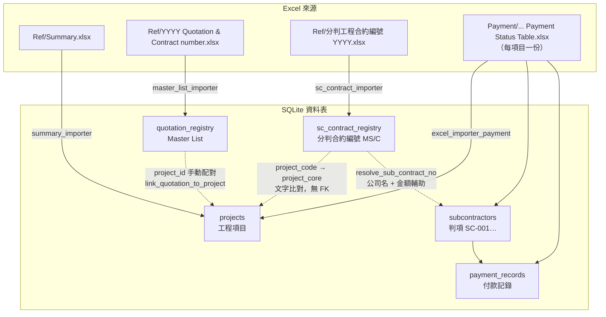

# OSsysCU 資料關聯說明

> 工程項目 · Master List · 分判合約編號（MS/C）· 地盤 Payment 表  
> 最後更新：2026-08-12

---

## 1. 總覽

OSsysCU 的核心資料來自 **四類 Excel**，匯入後分別存入不同 SQLite 資料表。三者以 **項目編號（`project_core`）** 為主要串連點，但 **沒有強制外鍵**，多數為文字比對或手動配對。

```
Ref/Summary.xlsx                          → projects（工程項目）
Ref/YYYY Quotation & Contract number.xlsx → quotation_registry（Master List）
Ref/分判工程合約編號 YYYY.xlsx            → sc_contract_registry（MS/C 主檔）
Payment/... Payment Status Table.xlsx     → subcontractors + payment_records（每項目）
```

---

## 2. 關聯架構圖



---

## 3. 各模組詳細說明

### 3.1 工程項目（`projects`）

| 項目 | 內容 |
|------|------|
| **Excel 來源** | 主要：`Ref/Summary.xlsx`（MP合約編號、主合約名稱、客方、MP承建金額）<br>輔助：各項目 Payment Status Table（補承建金額、判項、付款） |
| **匯入模組** | `summary_importer.py`、`excel_importer_payment.py` |
| **主鍵** | `project_code`（例：`MS_Q0185_25`） |
| **關聯鍵** | `quotation_no`、`mp_contract_code` |
| **角色** | 系統核心：一個地盤/主合約的所有 SC、付款、FAC 都掛在這裡 |

---

### 3.2 Master List（`quotation_registry`）

| 項目 | 內容 |
|------|------|
| **Excel 來源** | `Ref/2017~2026 Quotation & Contract number.xlsx` |
| **匯入模組** | `master_list_importer.py`、`master_ref.py` |
| **主鍵** | `quotation_no`（例：`MS/Q1241/24/kp`） |
| **關聯** | `project_id` → `projects`（需手動配對或 API 連結） |
| **連結後行為** | 同步 `quotation_no`、`person_in_charge`、`project_code` 至工程項目 |
| **分判欄位** | `subcon_company`、`subcon_amount` 為**整份報價/合約**層級，非逐筆 MS/C |

**與 MS/C 的關係：** 透過 `project_code` / `project_core` 間接對應。

| Master List | MS/C 主檔 |
|-------------|-----------|
| `MS/Q1491/24/jc` | `MS_Q1491_24_jc`（項目編號欄） |
| 正規化後 → `MS_Q1491_24` | `project_core` |

---

### 3.3 分判合約編號（`sc_contract_registry`）

| 項目 | 內容 |
|------|------|
| **Excel 來源** | `Ref/分判工程合約編號 YYYY.xlsx`（按年份 sheet，如 2026） |
| **匯入模組** | `sc_contract_importer.py`、`sc_contract_ref.py` |
| **主鍵** | `sub_contract_no`（例：`MS/C01-3/26/AZ`） |
| **主要欄位** | 外判公司、工程項目（文字）、項目編號、負責同事、分判合約金額、會簽/伙伴/定標 |
| **關聯方式** | `project_code` → 正規化為 `project_core`（`MS_Q1491_24`）再比對工程項目 |
| **工程項目欄** | Excel 原文描述，**不是** `projects` 表的外鍵 |

**MS/C 編號格式（2023 起）：** `MS/C月份-序號/年份/負責人`  
例：`MS/C07-1/25/jc` → 負責人縮寫 `jc`

**與判項（SC-001）的關係：** P1 FAC「分判合約編號」由 `resolve_sub_contract_no()` 解析，優先順序：

1. 判項手動填的 `sub_contract_no`
2. 判項 `quotation_no` 若已是 MS/C 格式
3. 依 `project_core` + 外判公司名（+ 金額輔助）從 MS/C 主檔配對
4. 父判項繼承

---

### 3.4 地盤判項與付款（`subcontractors` · `payment_records`）

| 項目 | 內容 |
|------|------|
| **Excel 來源** | `Payment/YYYY/MS_Qxxxx_xx - Main contract Works Payment Status Table.xlsx` |
| **匯入模組** | `excel_importer_payment.py`（相容入口 `excel_importer.py`） |
| **主鍵** | `subcontractors.id`；業務鍵 `(project_id, sc_no)` 如 `SC-001` |
| **金額欄位** | `contract_amount`、`contract_sum`（FAC 結算用） |
| **角色** | 地盤實際運作資料：判項、VO、付款、SC FAC |

---

## 4. 金額欄位對照

| 顯示名稱 | DB 欄位 | 來源 Excel | 粒度 | 驅動 FAC/付款 |
|----------|---------|------------|------|---------------|
| MP 承建金額 | `projects.contract_amount` | Summary / Payment 表 | 主合約 | 主合約 FAC |
| 分判總額 | `quotation_registry.subcon_amount` | Master List | 報價/合約 | 否（Master List 參考） |
| **分判合約金額** | `sc_contract_registry.amount` | 分判合約編號 Excel | 每筆 MS/C | **否**（主檔 + 配對輔助） |
| 判項原合約金額 | `subcontractors.contract_amount` | Payment Status Table | 每判項 SC-xxx | **是**（SC FAC 原合約） |

---

## 5. 分判合約金額（`sc_contract_registry.amount`）專章

### 5.1 性質

- 來自 `Ref/分判工程合約編號 YYYY.xlsx`
- **只寫入** `sc_contract_registry` 表
- **不會自動同步** 至 `subcontractors`、`quotation_registry` 或 `projects`

### 5.2 系統內用途

| 用途 | 說明 | 相關程式 |
|------|------|----------|
| 主檔顯示 | MS/C 分判合約編號頁面列表 | `frontend/js/sc_contract_registry.js` |
| MS/C 配對 | 同項目、同外判有多筆候選時，以金額接近判項 `contract_amount` 挑最佳 | `sc_contract_ref._pick_best_row()` |
| 孤兒偵測 | 列出 Excel 有、但項目判項未配對到的 MS/C | `sc_contract_ref.project_orphan_refs()` |

### 5.3 不會影響

| 欄位 | 實際用途 |
|------|----------|
| `subcontractors.contract_amount` | SC FAC、付款、VO 結算的「原合約金額」 |
| `quotation_registry.subcon_amount` | Master List 報價/合約層級分判總額 |
| `projects.contract_amount` | 主合約 MP 承建金額 |

**結論：** 分判合約金額是 Ref Excel 的**登記參考值**；地盤 Payment 表的判項金額才是**結算依據**。兩者應相近，但系統目前不會自動對齊。

---

## 6. 項目編號正規化（`project_core`）

不同來源的項目編號格式不一，系統以 `project_core` 統一比對：

| 原始格式 | 正規化結果 |
|----------|------------|
| `MS_Q1491_24_jc` | `MS_Q1491_24` |
| `MS_Q1491_24` | `MS_Q1491_24` |
| `Q1491_24` | `MS_Q1491_24` |
| `MS/Q1491/24/jc` | `MS_Q1491_24`（透過 projects 配對後） |

**實作：** `sc_contract_ref._project_core()`  
**比對鍵集合：** `sc_contract_ref._project_keys()` 取自 `project_code`、`mp_contract_code`、`quotation_no`、`job_no`

---

## 7. 實例

以 MS/C 主檔一筆為例：

| 欄位 | 值 |
|------|-----|
| 合約編號 | `MS/C01-3/26/AZ` |
| 外判公司 | 龍海工程有限公司 |
| 項目編號 | `MS_Q1491_24_...` |
| 分判合約金額 | HK$800,000 |

**資料流向：**

1. **MS/C 主檔** — 800,000 存於 `sc_contract_registry.amount`（Ref Excel 匯入）
2. **工程項目** — 若存在 `MS_Q1491_24` 項目，經 `project_core` 可對上
3. **Master List** — 若有 `MS/Q1491/24/...` 且已 `link_quotation_to_project`，連至同一工程項目
4. **地盤判項** — Payment 表內 SC-xxx 的 `contract_amount` 為 FAC 結算金額；MS/C 編號經配對邏輯顯示於 P1，但金額不自動同步

---

## 8. 匯入操作速查

| 資料 | UI 操作 | 指令列 |
|------|---------|--------|
| MS/C 主檔 | 分判合約編號頁 →「同步 Ref Excel」 | `python sc_contract_importer.py sync` |
| Master List | Master List 頁 → 匯入 | `python master_list_importer.py sync-all` |
| 工程項目 Summary | 系統設定 / API | `summary_importer.sync_summary_import()` |
| 地盤 Payment 表 | 工程項目 → 匯入 Excel | `python excel_importer_payment.py <path>` |

---

## 9. 相關原始碼

| 區塊 | 檔案 |
|------|------|
| DB schema / CRUD | `database.py` |
| MS/C Excel 解析 | `sc_contract_ref.py` |
| MS/C 匯入 | `sc_contract_importer.py` |
| Master List 匯入 | `master_list_importer.py` |
| 項目 Summary 匯入 | `summary_importer.py` |
| 地盤 Payment 匯入 | `excel_importer_payment.py` |
| MS/C 配對 / FAC 編號 | `sc_contract_ref.resolve_sub_contract_no()` |
| SC FAC 原合約金額 | `sc_fac.build_sc_fac()` → `sc.contract_amount` |
| MS/C 主檔 UI | `frontend/js/sc_contract_registry.js` |

---

## 10. 待討論（未實作）

- MS/C 主檔金額 vs 地盤判項金額不一致時 UI 提示
- 負責同事欄 `A / B` 格式正規化（目前為 Excel 原文）
- Master List `subcon_amount` 與 MS/C 逐筆金額加總對帳
